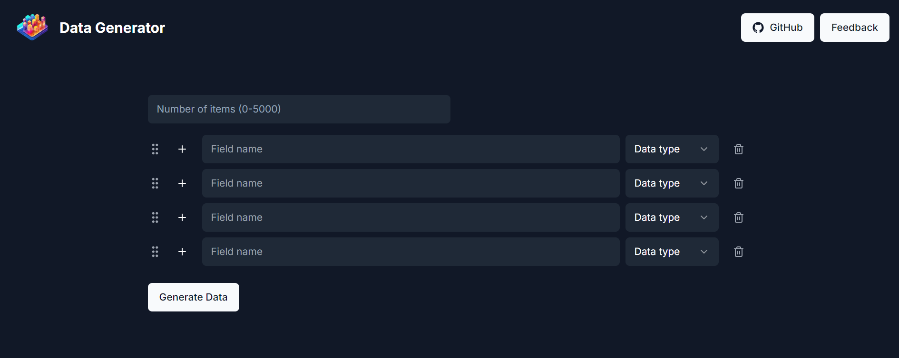

# Data Generator



A Next.js application built with Shadcn and Tailwind CSS, designed as a wrapper for Faker.js to generate custom synthetic datasets. This app enables users to define datasets with multiple columns, reorder columns using drag-and-drop, and export data in various formats.

## Features

- **Customizable Datasets**: Create datasets with multiple columns and customizable data types.
- **Drag-and-Drop Column Reordering**: Organize your dataset by rearranging columns to your preference.
- **Export in Multiple Formats**: Save generated datasets as CSV, JSON, or SQL files for easy integration into other projects.
- **Built with Next.js and Tailwind CSS**: Ensures a responsive and modern UI experience.
- **Powered by Faker.js**: Generates realistic, randomly generated data for various data fields.

## Getting Started

### Prerequisites

- Node.js and npm installed on your machine.

### Installation

1. Clone the repository:

    ```bash
    git clone https://github.com/BreisOne/data-generator.git
    cd data-generator
    ```

2. Install dependencies:

    ```bash
    npm install
    ```

3. Start the development server:

    ```bash
    npm run dev
    ```

4. Open the app in your browser at [http://localhost:3000](http://localhost:3000).

### Usage

1. **Select Columns**: Choose the data fields (e.g., name, address, date) to include in your dataset.
2. **Reorder Columns**: Use drag-and-drop functionality to reorder columns as needed.
3. **Generate Data**: Define the number of rows and generate data instantly.
4. **Export**: Download the generated dataset in CSV, JSON, or SQL format.

## Configuration

This app wraps Faker.js, so main Faker.js-supported data types are available. Customize fields in the UI to select the type of data to generate and give a name to each column.

## Contributing

Contributions are welcome! Please fork the repository, make your changes, and submit a pull request.

1. Fork the Project
2. Create your Feature Branch (`git checkout -b feature/YourFeature`)
3. Commit your Changes (`git commit -m 'Add Your Feature'`)
4. Push to the Branch (`git push origin feature/YourFeature`)
5. Open a Pull Request

## License

This project is licensed under the MIT License. See the [LICENSE](LICENSE) file for details.

## Contact

For questions or suggestions, feel free to open an issue or contact [BreisOne](https://github.com/BreisOne).

## Learn More

To learn more about Next.js, take a look at the following resources:

- [Next.js Documentation](https://nextjs.org/docs) - learn about Next.js features and API.
- [Learn Next.js](https://nextjs.org/learn) - an interactive Next.js tutorial.

You can check out [the Next.js GitHub repository](https://github.com/vercel/next.js/) - your feedback and contributions are welcome!

## Deploy on Vercel

The easiest way to deploy your Next.js app is to use the [Vercel Platform](https://vercel.com/new?utm_medium=default-template&filter=next.js&utm_source=create-next-app&utm_campaign=create-next-app-readme) from the creators of Next.js.

Check out our [Next.js deployment documentation](https://nextjs.org/docs/deployment) for more details.
